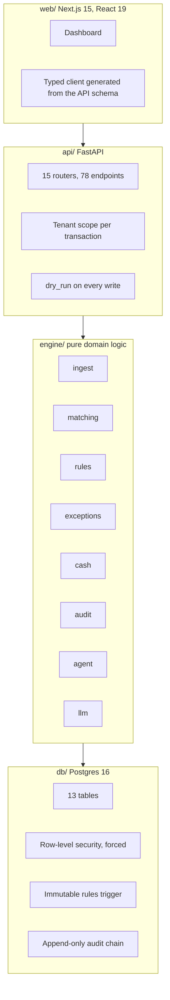
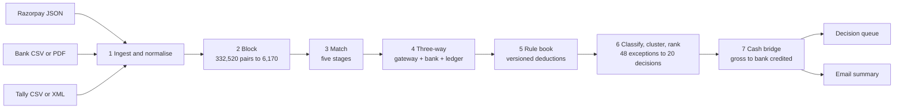
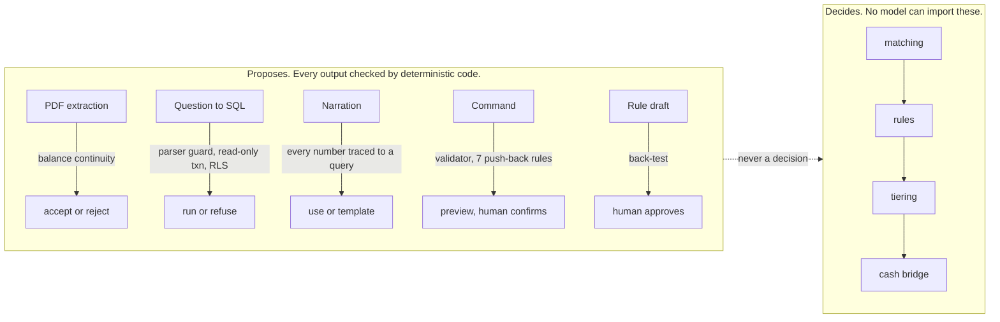

<div align="center">

# Finco

**AI Finance Controller for Razorpay settlements, Indian bank statements and Tally ledgers.**

Matches what it can prove. Refuses what it cannot. Hands you a short, ranked list of the rest, with evidence.

[](https://github.com/VarunPorwal/finance-controller/actions/workflows/ci.yml)


</div>

---

## What it does

A single bank credit of Rs 4,82,000 hides 14 Razorpay payments, 2 refunds, MDR, GST on MDR, TDS and a rolling reserve. The Tally daybook has one receipt voucher for all of it. The bank cut the narration at 100 characters and lost the reference. Someone spends three days a month making these agree.

Finco does that automatically:

- **Matches** gateway, bank and ledger records in five passes, strictest first, with the evidence recorded on every match.
- **Explains** the gaps that arithmetic cannot close with a versioned, effective-dated rule book.
- **Escalates** everything else as a ranked queue of decisions, each with the consequence of ignoring it and a recommended action.
- **Reports** the cash position (at risk, held in reserve, claimable as GST input credit) and emails you the summary when a run completes.

## Results

One run over 1,575 events with 21 injected failure modes, scored against the answer key.

| Metric | Value |
|---|---|
| Runtime | 0.25 s |
| Auto-matched | 700 events (44%) |
| Rule-resolved | 437 events (28%) |
| Precision on auto-close | **100%**, 0 wrong closes |
| Recall against ground truth | **98.4%** |
| Human queue | **20 items**, not 1,575 |

Four gates block a release and all four pass: `false_auto_resolutions == 0`, `never_auto_after_pipeline == 0`, recall at or above 90%, and byte-identical output for the same seed. Reproduce it with no database, no network and no API keys:

```bash
./scripts/dev.ps1 eval
```

## Architecture

Four layers, dependencies point down only. The engine is pure Python with no database, network or clock inside it, which is what makes the boundary mechanical: its only dependencies are `pydantic` and `python-dotenv`, and an import scan in CI fails the build if that changes.



### How a run works



### The five matching stages

Each stage is cheaper and more certain than the one after it. A row matched at one stage never reaches the next.

| Stage | Matches on | Can auto-close |
|---|---|---|
| 1 Exact reference | UTR, RRN or settlement id agree exactly and are not truncated | yes |
| 2 Fee-adjusted | `gross - fees = net`, checked per settlement | yes |
| 3 Date shift | same amount, 1 to 3 days apart, reference has a unique completion | yes |
| 4 Many-to-one | one bank credit against the gateway rows that sum to it | grouped path only |
| 5 Fuzzy | weighted resemblance, capped at 0.75 | never |

Five categories escalate no matter how confident the match looks: unrecorded chargebacks, duplicate ledger entries, ambiguous candidates, NACH batch lines and unknowns. When two answers are equally valid the engine emits neither and asks.

### Where the AI sits



Every model call falls back to a working non-AI answer. With every provider down, reconciliation still runs and every number still computes.

## Quick start

Requirements: Python 3.12, [uv](https://docs.astral.sh/uv/), Node 20+, Postgres 16 with `pgvector`.

```bash
cp .env.example .env
./scripts/dev.ps1 setup
./scripts/dev.ps1 migrate
```

Seed 500 orders and reconcile them:

```bash
./scripts/dev.ps1 demo
```

Start the API and the dashboard:

```bash
./scripts/dev.ps1 api
```

```bash
./scripts/dev.ps1 web
```

## Screens

| Screen | Question it answers |
|---|---|
| Overview | Is my money under control? |
| Run | Did it read my evidence correctly? |
| Decisions | Where is my money unexplained? |
| Settlements | What did each settlement actually do? |
| Reconcile | Do bank and books agree, line by line? |
| Cash | Where is my money, and will I have enough? |
| Rule Book | Why was this amount calculated this way? |
| Controller Activity | What did the engine do, and would it do it again? |
| Audit Trail | Can I prove what happened? |
| Evaluation | How accurate is it, measured? |
| Records | Show me the underlying evidence. |
| Guide | What is this, and how do I use it? |

The assistant in the top bar answers plain-English questions from the data and shows the SQL it ran.

## Email reports

When a run completes, the summary lands in your inbox without being asked: what matched, what a rule explained, how many decisions are waiting, and the cash at risk. Escalations, deadline reminders, rule suggestions and a daily digest arrive the same way. Sending is fire-and-forget, so a mail provider outage never blocks a run.

<p align="center">
  
</p>

## Safety and correctness

| Guarantee | Enforced by |
|---|---|
| Money is integer paise, never float | AST scan over every money module |
| Tenants cannot see each other's data | Postgres row-level security, forced, on a role with no bypass |
| Generated SQL cannot write or leak | parser guard, read-only transaction, RLS; each layer sufficient alone |
| Rules are immutable once active | database trigger; changes create version N+1 |
| The audit trail cannot be rewritten | UPDATE and DELETE revoked; SHA-256 hash chain |
| Same input, identical output | the pipeline re-runs inside the eval suite and results are compared |
| Nothing writes without a preview | every write endpoint accepts `dry_run` |

Bank narrations are treated as hostile input. They are sanitised, delimited and scanned, and a narration carrying instruction-shaped text is flagged to you as a security finding.

## Known limits

- Labelling is weaker than matching. Some unresolved items are filed under a neighbouring category. They still reach the queue; the failure is a wrong heading on a correct escalation, never a wrongly closed settlement.
- A settlement that straddles a mid-period fee change is not closed by one flat rate yet.
- NACH batch lines with no member detail never resolve. That is a permanent escalation, not a bug.
- ICICI, IDFC and Tally XML formats are modelled from the generator, not sourced from live exports. HDFC is real.

## Project structure

```
engine/src/fc/   pure domain logic: ingest, matching, rules, exceptions, cash, audit, agent, llm, eval, generator
api/             FastAPI routers, notifications, scheduler
db/              SQLAlchemy models and Alembic migrations
web/             Next.js dashboard with a generated API client
tests/           unit (offline), integration (real Postgres), eval (accuracy gates)
docs/PRD.md      full technical specification
```

## Commands

| Command | What it does |
|---|---|
| `./scripts/dev.ps1 fast` | lint, types, unit tests, about 30 s |
| `./scripts/dev.ps1 check` | everything, including integration and the eval gates |
| `./scripts/dev.ps1 eval` | accuracy suite, exits non-zero on a failed gate |
| `./scripts/dev.ps1 generate -Seed 42 -N 500` | regenerate the synthetic corpus |
| `./scripts/dev.ps1 client` | regenerate the TypeScript client after a model change |

A `Makefile` mirrors every target for machines with GNU Make.

---

Specification: [`docs/PRD.md`](docs/PRD.md). Engineering conventions: [`CLAUDE.md`](CLAUDE.md).
